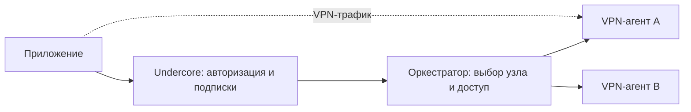

# Undercore Orchestrator

Самостоятельный технический сервис управления VPN-подключениями. Python 3.12,
FastAPI, SQLite; запуск через systemd. Репозиторий содержит код, тесты, контракты,
пример настроек и механизм обновления. Рабочие ключи и данные остаются на сервере.

- [Входящий API](../public/api.md)
- [Исходящий API и драйверы](../public/node-agent.md)
- [Установка, команды и обновление](operations.md)

## Границы ответственности



Undercore проверяет владельца, оплату, свободный слот и срок доступа. Оркестратор
получает разрешённое действие с каноническим `device_id`; пароли пользователей,
платежи и баланс слотов ему не передаются. Приложения общаются с API Undercore;
общий служебный токен оркестратора никогда не встраивается в клиент.

Оркестратор выбирает совместимый узел, сохраняет назначение устройства, вызывает
агента, возвращает протокольные параметры, продлевает и отзывает доступ. VPN-трафик
через него не проходит. На узлах без `lease_enabled` остановка оркестратора не разрывает туннель.
На узлах с короткими разрешениями длительная остановка управляющего сервиса
закрывает VPN-доступ; это сознательное условие безопасного переноса при полном
отказе узла. [Протокол и ограничения](node-leases.md).

SQLite хранит назначения, ревизии и незавершённые переключения, без приватных
VPN-ключей и конфигурационных документов. Файл конфигурации проходит через API в
оперативной памяти. На узлах агент обеспечивает срок действия и отзыв доступа.

## Модули

| Модуль | Назначение |
|---|---|
| `registry.py`, `admin_http.py` | Постоянный реестр узлов и отдельный операторский API |
| `leases.py` | Короткие разрешения, изоляция недоступного узла и очистка при возврате |
| `settings.py` | Проверка настроек и чтение отдельных файлов ключей |
| `agent_http.py`, `http_v2.py` | Авторизация служебного API, HTTP и совместимость v1 |
| `contracts.py`, `connections.py` | Независимый от протокола контракт v2 |
| `agent_gateway.py`, `assignments.py` | Назначения и журнал SQLite |
| `switches.py`, `recovery.py` | Возобновляемое переключение и ограниченное восстановление |
| `drivers.py`, `node_agent.py` | Граница драйверов и HTTPS к Amnezia-агенту |
| `cli.py` | Команды оператора без вывода секретных конфигураций |
| `scripts/` | Проверка контракта, упаковка, обновление релиза |

`amnezia.py`, `service.py`, `store.py`, `http.py`, `demo.py` — сохранённый
эксперимент со сторонним API. Он не используется рабочим `runtime:agent_app`;
`lab_app` требует отдельного флага и не является альтернативной production-точкой входа.

## Совместимость

Рабочий драйвер — AmneziaWG через Undercore agent; подходит для управляемых узлов
с разными версиями AWG, если агент и клиент поддерживают параметры протокола.
TrustTunnel предусмотрен контрактом, но драйвер пока не реализован и запросы
этого протокола отклоняются. Наличие имени в схеме не означает его поддержку.

Выбор узла учитывает совместимость, свежую доступность, режим и заполненность.
Автоматического географического выбора или измерения скорости у клиента пока нет.
`region` — метаданные узла, а не обещание выбрать ближайший.

## Проверки

```sh
python3 -m venv .venv
.venv/bin/python -m pip install -r requirements.lock
.venv/bin/python -m pytest -q
.venv/bin/python scripts/check_contracts.py
.venv/bin/python -m orchestrator --settings config/settings.example.json check-config --structure-only
```

`tests/fixtures/amnezia_agent` — зафиксированная копия собственного агента для
интеграционных тестов с подменённым VPN backend. Контрольные суммы находятся в
`provenance.json`. Тесты не требуют соседнего репозитория, SSH, Docker или VPN.
Изменять эту копию независимо от реального протокола агента нельзя.
