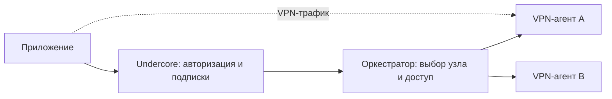

# Undercore Orchestrator

Самостоятельный технический сервис управления VPN-подключениями. Python 3.12,
FastAPI, SQLite; запуск через systemd. Репозиторий содержит код, тесты, контракты,
пример настроек и механизм обновления. Рабочие ключи и данные остаются на сервере.

- [Входящий API](../public/api.md)
- [Исходящий API и драйверы](../public/node-agent.md)
- [Установка, команды и обновление](operations.md)

## Границы ответственности



Undercore проверяет владельца, оплату, свободный слот и срок доступа. Оркестратор
получает разрешённое действие с каноническим `device_id`; пароли пользователей,
платежи и баланс слотов ему не передаются. Приложения общаются с API Undercore;
общий служебный токен оркестратора никогда не встраивается в клиент.

Оркестратор выбирает совместимый узел, сохраняет назначение устройства, вызывает
агента, возвращает протокольные параметры, продлевает и отзывает доступ. VPN-трафик
через него не проходит. На узлах без `lease_enabled` остановка оркестратора не разрывает туннель.
На узлах с короткими разрешениями длительная остановка управляющего сервиса
закрывает VPN-доступ; это сознательное условие безопасного переноса при полном
отказе узла. [Протокол и ограничения](node-leases.md).

SQLite хранит назначения, ревизии и незавершённые переключения, без приватных
VPN-ключей и конфигурационных документов. Файл конфигурации проходит через API в
оперативной памяти. На узлах агент обеспечивает срок действия и отзыв доступа.

## Модули

Актуальная карта: [архитектура](../public/architecture.md).
Рабочий код разделён на domain, application, interfaces, infrastructure и config.
Исторический эксперимент со сторонним API удалён вместе с тестами только этого
эксперимента. Тесты рабочего agent lifecycle сохранены. Корневые runtime/settings/
assignments/registry/cli и worker-модули — совместимые точки импорта для старых
release scripts и systemd units, не второй runtime.

## Совместимость

Рабочий драйвер — AmneziaWG через Undercore agent; подходит для управляемых узлов
с разными версиями AWG, если агент и клиент поддерживают параметры протокола.
TrustTunnel предусмотрен контрактом, но драйвер пока не реализован и запросы
этого протокола отклоняются. Наличие имени в схеме не означает его поддержку.

Выбор узла учитывает совместимость, свежую доступность, режим и заполненность.
Автоматического географического выбора или измерения скорости у клиента пока нет.
`region` — метаданные узла, а не обещание выбрать ближайший.

## Проверки

```sh
python3 -m venv .venv
.venv/bin/python -m pip install -r requirements-dev.txt
.venv/bin/python -m pytest -q
.venv/bin/python scripts/check_contracts.py
.venv/bin/python -m orchestrator --settings config/settings.example.json check-config --structure-only
```

`tests/fixtures/amnezia_agent` — зафиксированная копия собственного агента для
интеграционных тестов с подменённым VPN backend. Контрольные суммы находятся в
`provenance.json`. Тесты не требуют соседнего репозитория, SSH, Docker или VPN.
Изменять эту копию независимо от реального протокола агента нельзя.

## Подготовка нового устройства: устранение лишних запросов

Перед первым созданием backend может использовать точечный lookup вместо полного
обхода существующих назначений. Выбор узла по-прежнему получает свежие наблюдения;
независимые узлы проверяются параллельно. `policy.selection.observation_workers`
задаёт предел потоков на запрос: по умолчанию 4, допустимо 1–16. Внутри каждого
наблюдения проверка server_id и список клиентов выполняются последовательно;
дублирующий health перед этим убран. Таймауты задаёт прежняя `policy.agents`.

Это не кэш готовых конфигураций. SQLite по-прежнему атомарно резервирует capacity,
учитывая назначения, появившиеся за время проверки. Создание повторяется только
на закреплённом узле; перед мутацией проверяются lease, режим и server identity.
Медленный узел всё ещё может задерживать выбор в пределах HTTP-таймаутов, но
задержки одновременно проверяемых узлов не складываются. Предел на один запрос
не является глобальным ограничителем всех одновременных запросов API.

Проверки покрывают нулевое число обращений к узлам при отсутствии назначения,
отказ другого узла, утрату ответа создания, отключённый доступ, несовпадение
identity, параллельный выбор по заполненности и ограничения числа потоков.
